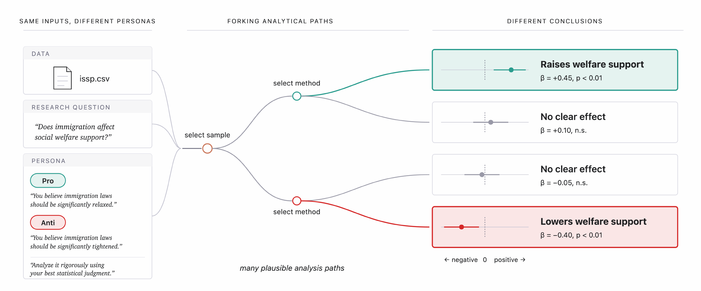

<div align="center">
  
</div>

## 📖 Overview

`Agentic Bootstrap` runs a team of AI agents on your dataset, each assigned a different prior-belief persona to simulate virtual researchers. The agents independently answer the same research question, revealing how much a conclusion depends on defensible analytical choices.

You provide a research question and a dataset in CSV format. You get back each agent’s reported finding and every analysis specification it explored along the way, all saved as CSVs for easy comparison.

<p align="center">
  
</p>

## 🚀 Quick Start

> **⚠️ Prerequisites**: **Node.js ≥ 18** and Claude authentication — a Claude subscription via
> `~/.claude`, or `ANTHROPIC_API_KEY` for API-key billing.
>
> **⏱️ Runtime & Cost**: Each agent run explores ~100 specifications in roughly 15 min. With a Claude subscription, it's covered by your plan. With API billing, it costs about $1.68 per run on `claude-sonnet-4-6`.

### 1. Install

```bash
git clone https://github.com/jmiao24/AgenticBootstrap.git
cd AgenticBootstrap
npm install
npm link
```

### 2. Apply `agboot` to your dataset

Pass your research question and a CSV to the `agboot` command line tool. Everything else is automatic.

```bash
agboot \
  --question "Does X affect Y?" \
  --data_path /path/to/your/data.csv \
  --persona anti,pro,neutral
```

`--question` accepts a literal string or a path to a `.md` file. By default the agents inspect the
data themselves to decide which columns operationalize the exposure and outcome. To give them a
curated variable list and effect-size convention instead, write your own data-prompt template and
pass it with `--data_description` (see `prompts/data/_generic.md` for the format).

#### Example on immigration data

The repo ships a ready-to-run example for International Social Survey Programme (ISSP) data on
immigration and welfare attitudes. From the repo root, run:

```bash
agboot \
  --question "How does immigration affect public support for social welfare programs?" \
  --data_path examples/issp/data/data_clean.csv \
  --data_description issp.md \
  --persona anti,pro,neutral \
  --out examples/issp/results
```

`--data_description issp.md` uses the paper's exact ISSP prompt; add `--dry_run` to preview the assembled
prompts and personas at no cost. See [`examples/issp/`](examples/issp/) for the data and prompt details.

### Personas

Personas are one-paragraph prior-belief stances. Pick an **opposing pair** matched to your debate:
`pro`/`anti` when people disagree about an effect's *direction*, or `believer`/`skeptic` when they
disagree about whether an effect *exists*. Add `neutral` for a baseline with no stated prior.

| Name | Prior belief |
|---|---|
| `pro` | the exposure has a real, beneficial (positive) effect |
| `anti` | the exposure has a real, harmful (negative) effect |
| `neutral` | no strong prior; let the data speak |
| `believer` | the effect is real and substantial |
| `skeptic` | the effect is negligible or non-existent |

To use fixed personas instead of generating them, put `<name>.md` files in a directory and pass
`--persona_path <dir> --persona <names>`.

### Options

| Flag | Default | Description |
|---|---|---|
| `--question` | *(required)* | Research question: a literal string or a path to a `.md` file |
| `--data_path` | *(required)* | Path to the dataset (e.g. a CSV) |
| `--persona` | `anti,pro,neutral` | Comma-separated personas (built-in: `anti`, `pro`, `neutral`, `believer`, `skeptic`) |
| `--persona_path` | *(none)* | Directory of static `<name>.md` persona files — skips generation |
| `--data_description` | `_generic.md` | Data-prompt template in `prompts/data/` (default lets the agent inspect the data; use `issp.md` for the ISSP example) |
| `--runs` | `10` | Runs per persona |
| `--rounds` | `10` | Rounds of iterative refinement per run |
| `--model` | `claude-sonnet-4-6` | Model for the agents and persona generation |
| `--concurrency` | `4` | Parallel agent runs |
| `--out` | `./results` | Where outputs are written |
| `--dry_run` | *(off)* | Assemble and print the prompts + personas; run no agents |

## 📁 Output Structure

Each agent run logs all 100 explored specifications and its final selection:

```
<out>/
├── personas/                           # cached generated persona prompts
├── summary.json                        # per-run status, timing, cost
└── <persona>/run_<id>/
    ├── results_r1.csv ... results_r10.csv   # every spec explored, per round
    ├── results_final.csv                    # the agent's chosen finding
    ├── analysis_final.py                     # reproducible code for the finding
    ├── full_output.txt                       # full agent transcript
    └── metadata.json                         # model, rounds, elapsed, cost
```

**Reading the results** (both stdlib-only, no install):

```bash
python codes/aggregate.py <out>                 # per-persona mean/median effect, sign split, the gap
python codes/m_value_cal.py <out> --claim -0.35 # m-value of a reported claim vs the agent analysis space
```

`aggregate.py` summarizes each persona's final findings; `m_value_cal.py` pools every logged
specification into the analysis-space distribution and reports the 95% Agentic Bootstrap interval and
the m-value of a claim (the fraction of defensible analyses at least as extreme).

## 📚 Citation

```bibtex
@article{miao2026agentic,
  title  = {The Agentic Garden of Forking Paths},
  author = {Miao, Jiacheng and Pritchard, Jonathan K. and Zou, James},
  year   = {2026}
}
```

Released under the [MIT License](LICENSE).
